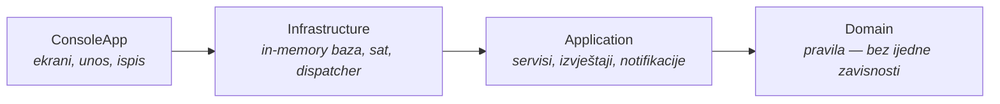
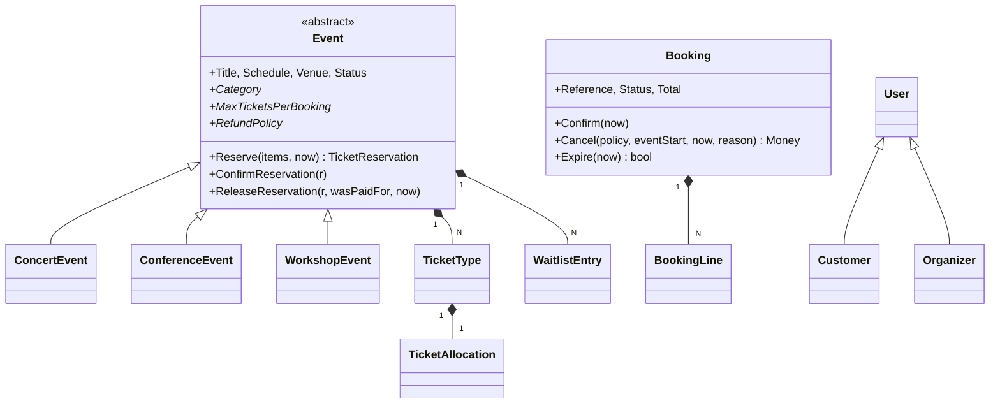

# Event Booking System

Objektno orijentisana aplikacija za rezervaciju ulaznica, pisana u C# / .NET 9.

Rješenje je podijeljeno u četiri projekta sa jednosmjernim zavisnostima, plus dva projekta sa
testovima. Domenski sloj nosi sva poslovna pravila i nema nijednu vanjsku zavisnost — ni NuGet
paket, ni referencu na drugi projekat.

```bash
dotnet run --project src/EventBooking.ConsoleApp
```

```bash
dotnet test
```

Aplikacija se pokreće sa napunjenim demo podacima (četiri događaja, četiri kupca, deset rezervacija),
pa se sve niže opisano može odmah vidjeti u radu. Testova ima 228 i prolaze svi.

---

## Sadržaj

- [Kako je zamišljen problem](#kako-je-zamišljen-problem)
- [Arhitektura](#arhitektura)
- [Domenski model](#domenski-model)
- [Gdje su OOP principi i zašto baš tu](#gdje-su-oop-principi-i-zašto-baš-tu)
- [Vrijeme kao zavisnost](#vrijeme-kao-zavisnost)
- [Testovi](#testovi)
- [Svjesni kompromisi](#svjesni-kompromisi)
- [Kako se ovo proširuje](#kako-se-ovo-proširuje)
- [Struktura repozitorija](#struktura-repozitorija)

---

## Kako je zamišljen problem

Tema je namjerno široka, pa je prva odluka bila **šta je ovdje zapravo teško**. Broj funkcionalnosti
nije problem — problem je da sistem ostane tačan kada se stvari preklope:

- dvoje ljudi kupuje posljednje mjesto u istom trenutku,
- neko započne kupovinu pa je napusti, a mjesta ostanu zauzeta zauvijek,
- organizator otkaže događaj nakon što je 200 ljudi platilo,
- radionica se ne popuni i nema smisla da se održi,
- cijena zavisi od toga ko kupuje, koliko kupuje i kada kupuje.

Sve ovo su pravila koja **ne smiju zavisiti od discipline programera** koji sutra doda novi ekran.
Zato su smještena unutar agregata, gdje ih se ne može zaobići, umjesto u servise gdje ih se lako
zaboravi pozvati.

Konkretno: **mjesta se oduzimaju iz fonda čim korisnik krene u kupovinu**, ne kada plati. Rezervacija
je vremenski ograničena (`Booking` u stanju `Pending`), i ako niko ne plati, mjesta se sama vrate.
To je jedina varijanta u kojoj brojevi ostaju tačni bez zaključavanja cijele baze.

---

## Arhitektura



Strelice idu samo u jednom smjeru. Domen ne zna da postoji konzola, baza ni DI kontejner; on
deklariše šta mu treba (`IClock`, `IEventRepository`, `IBookingReferenceGenerator`), a neko drugi to
dostavlja.

| Sloj | Odgovornost | Šta namjerno **nije** tu |
|---|---|---|
| **Domain** | Entiteti, agregati, vrijednosni objekti, poslovna pravila, domenski događaji | Bilo kakav I/O, framework, `DateTime.Now` |
| **Application** | Orkestracija slučajeva upotrebe, pretraga, izvještaji, notifikacije | Poslovna pravila (ona su u domenu) |
| **Infrastructure** | In-memory repozitoriji, sat, generator referenci, dispatcher, demo podaci | Odluke o tome *šta* je dozvoljeno |
| **ConsoleApp** | Meni, unos, formatiranje, composition root | Ijedna poslovna odluka |

Da ovo nije samo namjera, čuva `EventBooking.Domain.csproj` — prazan je. Ako mu ikada zatreba
`<ItemGroup>`, znači da je nešto procurilo unutra.

---

## Domenski model



**Dva agregata: `Event` i `Booking`.** `Event` je vlasnik mjesta, `Booking` je vlasnik novca. Granica
je namjerno tu — rezervacija ne dira inventar sama, nego `BookingService` pomjera oba zajedno. To je
jedino mjesto u sistemu gdje se dva agregata mijenjaju u istoj operaciji, i to je svjesno tako da se
kod prelaska na pravu bazu tačno zna gdje ide transakcija.

**Inventar je podijeljen na tri kante** (`TicketAllocation`): `Available`, `Reserved`, `Sold`. Zbir je
uvijek jednak kapacitetu, i to je invarijanta koju testovi provjeravaju direktno. Zahvaljujući tome,
napuštena kupovina i otkazana plaćena rezervacija vraćaju mjesta iz *različitih* kanti, što je razlika
koju bi jedan brojač izgubio.

**"Rasprodano" nije status.** Izvedeno je iz alokacija (`IsSoldOut`). Da je zapisano kao stanje, bilo
bi još jedna stvar koja može zastarjeti.

**Cijene i inventar su odvojeni.** `Event.Reserve` vraća `TicketReservation` sa *kataloškim* cijenama,
a šta će kupac stvarno platiti odlučuje `PricingEngine`. Rezervacija mjesta i obračun popusta se
mijenjaju iz potpuno različitih razloga.

---

## Gdje su OOP principi i zašto baš tu

Ovo nije lista obrazaca radi liste — svaki je odgovor na konkretan problem u ovom domenu.

### Nasljeđivanje: `Event` i tri podklase

Podklase se ne razlikuju po podacima nego po **ponašanju**. Bazna klasa drži tri apstraktne tačke
(`Category`, `MaxTicketsPerBooking`, `RefundPolicy`) i tri virtualne kuke (`OnValidateReservation`,
`OnValidatePublish`, `OnScheduledMaintenance`) — *template method*.

| | Koncert | Konferencija | Radionica |
|---|---|---|---|
| Ulaznica po rezervaciji | 6 | 20 (firme kupuju za timove) | 2 |
| Dodatno pravilo | najviše 2 VIP karte | dvije sesije ne mogu na isti track u isto vrijeme | minimalan broj polaznika |
| Uslov za objavu | mora imati standardnu kartu | mora imati program | minimum ≤ kapacitet |
| Povrat novca | 100% do 14 dana, 50% do 3 dana | 100% do 7 dana | 100% do 2 dana |
| Periodična provjera | — | — | sama se otkaže 48h prije ako se ne popuni |

Ako ovi redovi ne bi mogli biti različiti, nasljeđivanje ovdje ne bi bilo zasluženo i tri klase bi
trebale biti jedan `EventType` enum. Testovi u `EventTypeRuleTests` provjeravaju upravo te razlike.

### Strategija: `IRefundPolicy` i `IPricingRule`

Povrat novca je algoritam koji se razlikuje po tipu događaja, a popusti su algoritmi koji se
razlikuju po kampanji. Oba su objekti, ne `if`-ovi.

Posljedica koja se najviše isplati: **`Booking` ne zna kojem tipu događaja pripada.** Pri otkazivanju
prima politiku izvana (`Cancel(IRefundPolicy policy, ...)`), pa dodavanje četvrtog tipa događaja ne
dira klasu `Booking` uopšte.

`PricingEngine` prolazi kroz registrovana pravila po prioritetu i sabire popuste **do gornje granice**
(35%). Kad bi pravilo probilo granicu, ono se **skrati na preostali prostor** umjesto da se odbaci —
tako rezultat ne zavisi od toga kojim redom se granica dostigne. To je jedna od stvari koje je lako
pogriješiti, pa ima svoj test.

### Specifikacija: pretraga

Filteri su objekti (`EventInCategorySpecification`, `EventWithinBudgetSpecification`, …) koje
`EventSearchCriteria` slaže operatorima `And` / `Or` / `Not`. Zahvaljujući tome, novo polje u pretrazi
je jedan `if` u `ToSpecification()`, a repozitorij se ne dira. Alternativa — `Func<Event, bool>`
razbacan po servisima — ne može se ni imenovati ni testirati zasebno.

### Domenski događaji i observer

Agregati bilježe šta se desilo (`BookingConfirmed`, `TicketsReleased`, `EventRescheduled`), a
`DomainEventDispatcher` to isporuči rukovaocima nakon što je operacija završena.

Najbolji primjer koristi: **`BookingService` ni na jednom mjestu ne spominje listu čekanja.** Kada se
mjesta oslobode, `Event` objavi `TicketsReleasedDomainEvent`, a `WaitlistNotificationHandler` obavijesti
prve na redu. Ista stvar sa svih pet e-mail obavještenja — nijedan servis ne zna da notifikacije
postoje.

Dispatcher prvo isprazni listu događaja pa tek onda poziva rukovaoce; inače bi rukovalac koji dirne
isti agregat dodavao u listu po kojoj se upravo iterira.

### Enkapsulacija

Sve kolekcije su izložene kao `IReadOnlyList<T>`, svi setteri su `private set`, a jedini način da se
mjesto zauzme je `Event.Reserve`. Preprodaja nije spriječena provjerom na pravom mjestu — spriječena
je time što drugog mjesta nema.

### Vrijednosni objekti

`Money`, `Percentage`, `DateRange`, `EmailAddress`, `BookingReference` i jaki identifikatori
(`EventId`, `BookingId`, …). `Money` zaokružuje jednom, u konstruktoru, i odbija sabiranje različitih
valuta. Jaki identifikatori znače da zamjena kupca i događaja ne prolazi kompajler.

Namjerno **nema ručno pisane `ValueObject` bazne klase**: `record` i `readonly record struct` već daju
strukturnu jednakost. `Money` i `Percentage` su strukture jer im je nulta vrijednost smislena;
`DateRange` i `EmailAddress` su klase jer bi im podrazumijevana vrijednost bila besmislena, a ovako ih
hvata nullable analiza.

### Rukovanje greškama

Dvije odvojene hijerarhije, jer su to dvije različite stvari:

- `DomainException` — korisnik je tražio nešto što posao ne dozvoljava. Poruka je pisana za njega i
  konzola je prikazuje direktno.
- `ArgumentException` / `InvalidOperationException` — pozivajući kod griješi. Korisnik to ne treba
  vidjeti.

`InsufficientTicketsException` nosi i brojeve (`Requested`, `Available`), pa korisnički sloj može
ponuditi listu čekanja bez novog upita.

---

## Vrijeme kao zavisnost

Pola ovog domena zavisi od vremena: early bird popust, prozori za povrat novca, isticanje rezervacije,
prodajni prozor karata, održivost radionice, zatvaranje završenog događaja. Nijedno od toga se ne bi
moglo testirati da pravila zovu `DateTimeOffset.UtcNow`.

Zato postoji `IClock`, a konzola ga koristi za nešto što se inače rijetko vidi: **meni „Simulation“
pomjera sat naprijed**. Rezervacija istekne, popust nestane, radionica se sama otkaže i vrati novac —
uživo, umjesto u dokumentaciji. U produkciji se registruje `SystemClock` i ništa drugo se ne mijenja.

---

## Testovi

228 testa, podijeljena po tome šta dokazuju:

| Projekat | Šta pokriva |
|---|---|
| `EventBooking.Domain.Tests` (171) | Pravila u izolaciji: aritmetika novca, invarijante alokacije, životni ciklus događaja, pravila po tipu događaja, prelasci stanja rezervacije, slaganje popusta i granica, politike povrata, kompozicija specifikacija |
| `EventBooking.Application.Tests` (57) | Cijeli tokovi kroz stvarne servise, stvarni domen i in-memory repozitorije |

Aplikacijski testovi **ne koriste mock biblioteke**. Ono što je ovdje zanimljivo *jeste* način na
koji dijelovi rade zajedno; mock bi samo potvrdio da test poznaje vlastito ožičenje. Umjesto toga,
`TestHost` diže cijeli sistem kroz iste `AddEventBooking…` ekstenzije koje koristi i konzola, pa
propuštena registracija pada u testu, a ne pri pokretanju.

Nekoliko testova koji nose najviše težine:

- `Reserve_WhenALaterLineFails_LeavesNoSeatsHeld` — narudžba se validira u cijelosti prije nego se
  zauzme ijedno mjesto.
- `StackedDiscounts_AreCappedAndTheLastOneIsTrimmedToFit` — granica popusta je deterministična.
- `AWorkshopThatDidNotFillUpCancelsItselfAndRefundsEveryone` — cijeli lanac: agregat odluči, servis
  primijeti, rezervacije se vrate.
- `ReleasedSeats_ReachTheFrontOfTheWaitingList` — lista čekanja radi bez ijednog spominjanja u servisu.
- `ATierGrantedUpFront_IsNotLostOnTheNextBooking` — greška koju je otkrilo pokretanje aplikacije, pa
  je dobila test.

---

## Svjesni kompromisi

Stvari koje su odlučene ovako, a ne slučajno propuštene.

**Podaci su u memoriji.** Zadatak traži OOP dizajn, ne konfiguraciju baze. `IRepository` je namjerno
malen — nema `Update` ni `Remove`, jer ih ništa u sistemu ne treba: agregati se mijenjaju kroz vlastite
metode, a događaji se otkazuju a ne brišu. Prava baza bi dodala *unit of work* oko toga.

**Nema stvarne konkurentnosti.** Repozitoriji su zaključani pa se kolekcija ne može pokvariti, ali
poslovna operacija nije atomična — dvoje ljudi koji istovremeno grabe posljednje mjesto trebali bi
transakciju ili optimistično zaključavanje (`RowVersion` na alokaciji). Struktura je namijenjena za to:
sve što bi tražilo transakciju već je u jednoj metodi `BookingService`.

**Sve je sinhrono.** Nema I/O, pa bi `async` ovdje bio ceremonija bez sadržaja.

**`EventCatalogService` zavisi od `BookingService`.** Otkazivanje događaja mora otkazati i sve
rezervacije. Moglo je i preko rukovaoca domenskog događaja, ali to skriva tok izvršavanja za nešto
što nije nuspojava nego dio same operacije. Rukovaoci ovdje šalju obavještenja, ne mijenjaju novac.

**Notifikacije završavaju u `NotificationInbox`.** Ispis usred menija bi razbio ekran; ovako se u
meniju „Notification inbox“ vidi tačno ono što bi mail server dobio.

**Sesija drži i kupca i organizatora istovremeno.** Pojednostavljenje demoa, da se recenzent može
kretati kroz obje strane sistema bez prijavljivanja. Model to ne pretpostavlja.

**Tri analizatorska pravila su isključena**, svako sa obrazloženjem u `.editorconfig` — najvažnije
CA1716, koje traži da se klasa `Event` preimenuje jer je `Event` ključna riječ u VB-u. Ovo je
aplikacija, a ne biblioteka, i „događaj“ je riječ koju koristi posao.

Ostatak koda se gradi sa `TreatWarningsAsErrors` i `latest-recommended` analizatorima — **nula upozorenja**.

---

## Kako se ovo proširuje

Test proširivosti nije „može li se“, nego **koliko postojećih fajlova se mora dirati**.

**Novi tip događaja** (npr. festival na više dana i lokacija): jedna klasa koja nasljeđuje `Event` i
implementira tri člana. `Booking`, `PricingEngine`, repozitoriji i pretraga se ne diraju.

**Novi popust** (npr. promo kod): jedna klasa koja implementira `IPricingRule` i jedan red u
`ApplicationServiceRegistration`. `PricingEngine` se ne mijenja — pravila skuplja kroz DI.

**Novi filter pretrage**: jedna specifikacija i jedan `if` u `EventSearchCriteria.ToSpecification()`.

**Slanje pravih e-mailova**: nova implementacija `INotificationChannel`, jedna promijenjena
registracija. Rukovaoci ne znaju razliku.

**Prava baza**: nove implementacije `IEventRepository` i drugova. Domen ostaje netaknut — nema
atributa, nema baznih klasa ORM-a, ništa.

**Web API umjesto konzole**: aplikacijski sloj se ne dira. Kontroleri pozivaju iste servise koje
pozivaju i ekrani.

---

## Struktura repozitorija

```
src/
  EventBooking.Domain/            bez ijedne zavisnosti
    Common/                       Entity, AggregateRoot, Guard, IDomainEvent
    ValueObjects/                 Money, Percentage, DateRange, EmailAddress, identifikatori
    Events/                       Event + tri podklase, TicketType, TicketAllocation, lista čekanja
      Specifications/             filteri kataloga
    Bookings/                     Booking, BookingLine, domenski događaji
    Pricing/                      PricingEngine + pravila
    Refunds/                      IRefundPolicy + politike
    Users/, Venues/               Customer, Organizer, Venue
    Abstractions/                 IClock, repozitoriji, Specification<T>
    Exceptions/                   DomainException i potomci
  EventBooking.Application/
    Catalog/                      EventCatalogService, kriteriji pretrage
    Bookings/                     BookingService
    Maintenance/                  MaintenanceService
    Reporting/                    ReportingService + read modeli
    Notifications/                kanal, rukovaoci domenskih događaja
  EventBooking.Infrastructure/
    Persistence/                  in-memory repozitoriji
    Time/                         SystemClock, AdjustableClock
    Messaging/                    DomainEventDispatcher
    Seeding/                      DemoDataSeeder
  EventBooking.ConsoleApp/
    Screens/                      meni i ekrani
    Ui/                           IUserInterface, ConsoleUi, formatiranje
tests/
  EventBooking.Domain.Tests/
  EventBooking.Application.Tests/
```
