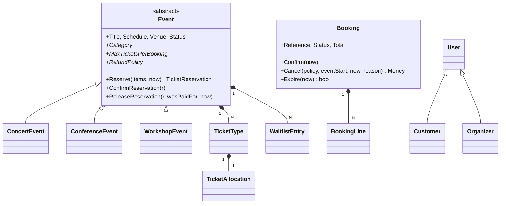

# Event Booking System

Konzolna aplikacija za rezervaciju ulaznica, C# i .NET 9.

```bash
dotnet run --project src/EventBooking.ConsoleApp
```

Pokreće se sa demo podacima (četiri događaja, četiri kupca, deset rezervacija), pa se sve može odmah
vidjeti u radu. Prvo traži prijavu, a meni zavisi od toga je li prijavljeni korisnik kupac ili
organizator.

[TESTING.md](TESTING.md) sadrži scenarije kojima se prolazi kroz aplikaciju, sa očekivanim ishodom
svakog koraka.

## Šta je ovdje bilo teško

Tema je široka, pa je prva odluka bila šta je u njoj zapravo teško. Nije broj funkcionalnosti, nego
to da brojevi ostanu tačni kad se stvari poklope: dvoje ljudi grabi zadnje mjesto, neko krene u
kupovinu pa odustane, organizator otkaže događaj kad je 200 ljudi već platilo, radionica se ne
popuni.

Zato se mjesta oduzimaju iz fonda **čim korisnik krene u kupovinu**, a ne kad plati. Rezervacija ima
rok, i ako plaćanje ne stigne, mjesta se sama vrate. Sva takva pravila žive u samim agregatima, da ih
se ne može zaobići dodavanjem novog ekrana.

## Arhitektura


Slojevi su odvojeni u četiri projekta, a ne u foldere, da bi zavisnost bila nemoguća a ne samo
nepoželjna. `EventBooking.Domain.csproj` nema nijednu referencu ni NuGet paket. Ako mu ikad zatreba,
znači da je nešto procurilo unutra.

## Domenski model



Dva su agregata. `Event` je vlasnik mjesta, `Booking` je vlasnik novca. Granica je postavljena tu
jer se to dvoje mijenja iz različitih razloga. Jedino ih `BookingService` pomjera zajedno, pa se
tačno zna gdje bi išla transakcija kad bi došla prava baza.

Inventar nije jedan brojač nego tri kante: slobodno, zadržano, prodano. Njihov zbir je uvijek
kapacitet. Zahvaljujući tome se napuštena kupovina i otkazana plaćena rezervacija vraćaju iz
različitih kanti, što bi jedan brojač izgubio.

## Zašto baš ovi obrasci

**Tri podklase događaja.** Koncert, konferencija i radionica se ne razlikuju po podacima nego po
pravilima, pa su zaslužile nasljeđivanje. Da su razlike samo kozmetičke, bio bi dovoljan jedan enum.

| | Koncert | Konferencija | Radionica |
|---|---|---|---|
| Karata po rezervaciji | 6 | 20 | 2 |
| Dodatno pravilo | najviše 2 VIP karte | dvije sesije ne mogu na isti track u isto vrijeme | minimalan broj polaznika |
| Uslov za objavu | mora imati standardnu kartu | mora imati program | minimum ne prelazi kapacitet |
| Povrat novca | 100% do 14 dana, 50% do 3 dana | 100% do 7 dana | 100% do 2 dana |
| Sama se otkaže | ne | ne | 48h prije, ako se ne popuni |

**Politike povrata i pravila cijena su objekti, ne `if`-ovi.** Najviše se isplati to što `Booking` ne
zna kojem tipu događaja pripada: politiku dobije izvana pri otkazivanju, pa četvrti tip događaja ne
bi dirao tu klasu. Popusti se sabiraju do granice od 35%, a ako je pravilo probije, skrati se na
preostali prostor umjesto da otpadne, da rezultat ne zavisi od redoslijeda.

**Filteri pretrage su specifikacije** koje se slažu sa `And`, `Or` i `Not`, pa je novo polje u
pretrazi jedan `if`, a repozitorij se ne dira.

**Domenski događaji.** `BookingService` nigdje ne spominje listu čekanja. Kad se mjesta oslobode,
`Event` objavi da su vraćena, a rukovalac obavijesti prve na redu. Isto važi za svih pet e-mail
obavještenja: nijedan servis ne zna da notifikacije uopšte postoje.

**Enkapsulacija.** Kolekcije izlaze kao `IReadOnlyList`, setteri su privatni, a mjesto se može
zauzeti samo kroz `Event.Reserve`. Preprodaju ne sprječava provjera na pravom mjestu, nego to što
drugog mjesta nema.

**Uloge i vlasništvo.** `Customer` i `Organizer` su podklase, ne zastavica. Najvažnija provjera, da
događaj mijenja samo njegov vlasnik, stoji u samom agregatu: `Publish`, `Cancel`, `Reschedule` i
ostale traže identitet pozivaoca kao parametar, pa servis ne može zaboraviti provjeru.

**Prijava.** `IAuthenticator` odgovara samo na pitanje ko zove. Šta taj neko smije ostaje na agregatu
i na filtriranju menija. Odbijena prijava namjerno ne kaže zašto je odbijena, jer bi razlika između
nepoznate adrese i neispravnog formata odala koje adrese postoje.

**Vrijednosni objekti.** `Money` zaokružuje jednom i odbija sabiranje različitih valuta. Jaki
identifikatori znače da zamjena kupca i događaja ne prođe kompajler. Bazna klasa za njih nije pisana
jer `record` već daje strukturnu jednakost.

**Greške su dvije vrste.** `DomainException` znači da je korisnik tražio nešto što posao ne
dozvoljava, i njegova poruka ide pravo na ekran. `ArgumentException` znači da griješi kod, i to
korisnik ne treba vidjeti.

## Simulacija vremena

Ovom dijelu je posvećeno najviše pažnje.

Skoro sve zanimljivo u ovoj domeni zavisi od vremena: early bird popust, rokovi za povrat novca,
istek rezervacije, prozor prodaje karata, održivost radionice, zatvaranje događaja koji je prošao.
Da pravila zovu `DateTimeOffset.UtcNow`, ništa od toga se ne bi moglo pokazati, samo opisati.

Zato vrijeme ulazi kroz `IClock`, a konzola ima meni **Simulation** koji pomjera sat naprijed i
pokreće zakazani posao. Onda se uživo vidi kako neplaćena rezervacija istekne i vrati mjesta, kako
early bird popust nestane kad koncert padne ispod 30 dana, kako se radionica sama otkaže i svima
vrati novac, i kako se prošli događaji zatvore. U produkciji bi se registrovao `SystemClock` i ništa
drugo se ne bi mijenjalo.

Korisno je znati i da vraćanje sata ne poništava ono što se već desilo. Otkazano ostaje otkazano.
Vrijeme je ulaz u sistem, ne dugme za poništavanje.

## Šta je svjesno izostavljeno

Podaci su u memoriji, jer je zadatak o OOP dizajnu a ne o konfiguraciji baze. `IRepository` je zato
namjerno malen, bez `Update` i `Remove`, jer se agregati mijenjaju kroz vlastite metode.

Prava konkurentnost ne postoji. Repozitoriji su zaključani pa se kolekcija ne može pokvariti, ali
dvoje ljudi koji istovremeno grabe zadnje mjesto tražili bi transakciju. Sve što bi je tražilo već je
u jednoj metodi `BookingService`, pa bi to bila lokalna izmjena.

Sve je sinhrono, jer nema I/O i `async` bi bio ceremonija bez sadržaja.

Prijava postoji kao granica, ali se ništa ne dokazuje. Lozinka bi se provjeravala protiv heša koji
nestane kad se aplikacija ugasi, dakle izgled sigurnosti bez sigurnosti. Prava implementacija mijenja
jednu klasu i jedan red registracije.

Konferencija se kroz konzolu ne može objaviti, jer traži program, a ekran za dodavanje sesija nije
napravljen. Domen to podržava i demo podaci ga koriste.

Tri analizatorska pravila su isključena, svako sa obrazloženjem u `.editorconfig`. Ostalo se gradi sa
`TreatWarningsAsErrors`, dakle upozorenje ruši build, i trenutno ih nema nijedno.

## Kako se ovo proširuje

Mjera je koliko postojećih fajlova treba dirati.

Novi tip događaja je jedna klasa koja nasljeđuje `Event`. Novi popust je jedna klasa i jedan red
registracije. Novi filter pretrage je jedna specifikacija i jedan `if`. Prava baza su nove
implementacije repozitorija, a domen ostaje netaknut jer u njemu nema ni atributa ni baznih klasa
ORM-a. Web API umjesto konzole ne bi dirao aplikacijski sloj, jer bi kontroleri zvali iste servise
koje zovu i ekrani.

## Struktura

```
src/
  EventBooking.Domain/            bez ijedne zavisnosti
    Common/                       Entity, AggregateRoot, Guard
    Entities/                     Event i tri podklase, Booking, User, Venue, TicketType
    ValueObjects/                 Money, Percentage, DateRange, EmailAddress, identifikatori
    Enums/                        statusi, kategorije, nivoi karata i članstva
    Interfaces/                   IClock, repozitoriji, IPricingRule, IRefundPolicy
    Specifications/               filteri kataloga
    DomainEvents/                 događaji rezervacije i događaja
    Pricing/                      PricingEngine i pravila
    Refunds/                      politike povrata
    Exceptions/                   DomainException i potomci
  EventBooking.Application/       servisi, izvještaji, notifikacije, prijava
  EventBooking.Infrastructure/    in-memory repozitoriji, sat, dispatcher, demo podaci
  EventBooking.ConsoleApp/        meni, ekrani, formatiranje
```
